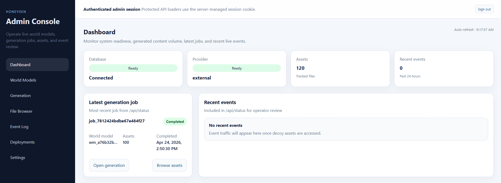
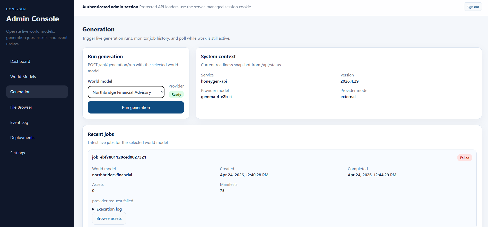

# Honeygen
Honeygen is a honeypot that generates realistic decoy enterprise files from a world model, serves those files over multiple protocols, and records access telemetry in a unified event log.

It is designed for security research and deception workflows: build a believable file corpus, expose it through decoy endpoints (HTTP/FTP/NFS/SMB), and observe how those resources are accessed.



## What Honeygen Includes

- A Go API for world models, generation jobs, assets, deployments, provider settings, and events
- A React admin UI for operating the system end-to-end
- A decoy web service that serves generated files under `/generated/*` and forwards access events
- Protocol deployments that can expose generated file trees over HTTP, FTP, NFS, and SMB
- SQLite-backed metadata persistence plus volume-backed generated files

## Quickstart (Docker + `.env`)

### 1) Prerequisites

- Docker Desktop / Docker Engine with Docker Compose v2
- An OpenAI-compatible provider endpoint and API key (required for generation)

### 2) Create `.env`

```bash
cp .env.example .env
```

### 3) Set required values in `.env`

At minimum, set these to real values:

- `APP_ENV` (for local use: `development`)
- `INTERNAL_EVENT_INGEST_TOKEN` (shared secret between `api` and `decoy-web`)
- `ADMIN_PASSWORD` (used for `/api/auth/login` and UI login)
- `PROVIDER_CONFIG_ENCRYPTION_KEY` (used to encrypt saved provider API keys in SQLite)

For generation to work immediately, also set:

- `LLM_BASE_URL`
- `LLM_API_KEY`
- `LLM_MODEL`

Notes:

- Keep `VITE_API_BASE_URL=` empty for Docker Compose default behavior; the admin UI then uses same-origin `/api/*` proxying through NGINX.
- `DEPLOYMENT_PORTS` publishes the deployment/listener port range (`9000-9020` by default), while deployment records are validated to use ports `9000-9010`.
- `FTP_PASSIVE_PORTS` defaults to `9011-9020` for FTP passive data channels.

### 4) Build and run

```bash
docker compose up --build -d
```

### 5) Open the services

- Admin UI: [http://localhost:4173](http://localhost:4173)
- API health probe: [http://localhost:8080/healthz](http://localhost:8080/healthz)
- Decoy web: [http://localhost:8081](http://localhost:8081)

### 6) Log in to the UI

Use the `ADMIN_PASSWORD` you set in `.env`.

## Project Overview

Runtime services in `docker-compose.yml`:

- `api` (`backend/cmd/api`): main API, SQLite access, generation orchestration, deployment manager
- `admin-web` (`frontend` build served by NGINX): operator console + `/api/*` reverse proxy
- `decoy-web` (`backend/cmd/decoy-web`): serves `/generated/*` and forwards non-health HTTP telemetry

Storage model:

- SQLite metadata: `/app/storage/sqlite/honeygen.db` (Compose volume: `sqlite-data`)
- Generated files: `/app/storage/generated` (Compose volume: `generated-assets`)

## Repository Layout

```text
honeygen/
  backend/
    cmd/
      api/                 # API service entrypoint
      decoy-web/           # Decoy web service entrypoint
    internal/
      api/                 # HTTP handlers + routing + auth/session
      app/                 # App wiring, startup, dependency graph
      generation/          # Planner + generation service + job lifecycle
      deployments/         # HTTP/FTP/NFS/SMB deployment manager
      worldmodels/         # World model validation/persistence/seed
      assets/              # Asset metadata repository
      events/              # Event ingestion and query services
      rendering/           # HTML/Markdown/Text/CSV/PDF/DOCX/XLSX renderers
      storage/             # Filesystem storage abstraction
      db/                  # SQLite migrations and status queries
      provider/            # OpenAI-compatible provider integration
      ipintel/             # Optional GeoIP/RDAP enrichment pipeline
    Dockerfile
  frontend/
    src/
      api/                 # Browser API client modules
      pages/               # Dashboard, Generation, Files, Events, Deployments, Settings
      components/          # UI components
      app/                 # Router and shell
    Dockerfile
    nginx.conf             # API proxy and download routing
  sample-data/
    world-models/          # Seed world model JSON
  docs/                    # Architecture/API/data model documentation
  docker-compose.yml
  .env.example
```

## How File Generation Works



Honeygen generation is deterministic in structure and variable in content.

1. A world model is loaded from SQLite (`/api/world-models/:id`).
2. The planner builds a manifest of target assets:
   - baseline public/intranet docs
   - per-department memos
   - per-employee project summaries
   - per-employee varied personal/work files from a template pool
3. If `generation_settings` is present in the world model (`file_count_target`, `file_count_variance`), employee file counts vary accordingly.
4. For each manifest entry, Honeygen calls the configured OpenAI-compatible provider once.
5. Provider text is normalized and rendered into the requested output format (`html`, `markdown`, `text`, `csv`, `pdf`, `docx`, `xlsx`).
6. Files are written under:
   - `generated/<world_model_id>/<generation_job_id>/...`
7. Asset metadata is stored in SQLite (`assets` table), including MIME type, checksum, and `previewable` status.
8. Job summaries/logs are persisted in `generation_jobs`.

Generation jobs can be listed, canceled, and deleted via `/api/generation/jobs*`.

## UI and API (General Guide)

### Admin UI

The UI is a React app with authenticated routes and session-cookie auth.

Main sections:

- **Dashboard**: system/provider status, counts, recent events, latest job
- **World Models**: list/create/update world models
- **Generation**: run jobs and track status
- **File Browser**: inspect asset trees, preview safe text formats, upload/delete assets
- **Event Log**: inspect captured telemetry
- **Deployments**: create/start/stop/delete protocol deployments
- **Settings**: configure and test provider settings

### API

Base URL: `http://localhost:8080`

Key behavior:

- Most `/api/*` endpoints require an authenticated admin session cookie.
- Login endpoint: `POST /api/auth/login` with `{ "password": "..." }`.
- Internal event ingest endpoint: `POST /internal/events` secured by `X-Honeygen-Internal-Event-Token`.

Primary endpoint groups:

- Auth/session: `/api/auth/login`, `/api/auth/logout`, `/api/auth/session`
- Health/status: `/healthz`, `/api/health`, `/api/status`
- Provider/settings: `/api/provider/test`, `/api/settings/provider`
- World models: `/api/world-models*`, `/api/world-models/generate`
- Generation/jobs: `/api/generation/run`, `/api/generation/jobs*`
- Assets: `/api/assets*`, `/api/assets/tree`, `/api/assets/upload`
- Events: `/api/events*`
- Deployments: `/api/deployments*`, `/api/deployments/:id/start`, `/api/deployments/:id/stop`

## Dependencies

### Runtime / infrastructure

- Docker + Docker Compose v2
- SQLite (`modernc.org/sqlite`) for metadata persistence
- `wkhtmltopdf` in API runtime image for PDF rendering
- Samba `smbd` in API runtime image for SMB deployments

### Backend (Go)

- Go 1.24+
- Key modules: `github.com/google/uuid`, `goftp.io/server/v2`, `github.com/willscott/go-nfs`, `github.com/xuri/excelize/v2`, `modernc.org/sqlite`

### Frontend

- Node.js 20+ (Dockerfile uses `node:20-bookworm-slim`)
- React 18, React Router, TypeScript, Vite, `marked`, `dompurify`

### Optional operator/client tools (for protocol testing)

- SMB: `smbclient` (WSL/Linux; for native support on Windows, port 445 is needed)
- FTP: `curl`
- NFS: Linux/WSL `mount -t nfs` support

## Deployment Instructions (HTTP, FTP, NFS, SMB)

Honeygen deployments expose files from a completed generation job.

### Common deployment workflow

1. Generate files (job status must be `completed`).
2. Create a deployment (`protocol`, `port`, `root_path`) on `9000-9009`.
3. Start the deployment.
4. Connect with an appropriate client.
5. Observe telemetry in the Event Log.

You can do this from the **Deployments** page or via API.

### API example: authenticate first

```bash
BASE="http://localhost:8080"
PASS="<your ADMIN_PASSWORD>"

# Create an authenticated session cookie.
curl -s -c cookies.txt -H "Content-Type: application/json" \
  -d "{\"password\":\"$PASS\"}" \
  "$BASE/api/auth/login"
```

### API example: create and start a deployment

```bash
JOB_ID="<completed_generation_job_id>"
WORLD_ID="northbridge-financial"

# Create an FTP deployment on port 9002.
curl -s -b cookies.txt -H "Content-Type: application/json" \
  -d "{\"generation_job_id\":\"$JOB_ID\",\"world_model_id\":\"$WORLD_ID\",\"protocol\":\"ftp\",\"port\":9002,\"root_path\":\"/\"}" \
  "$BASE/api/deployments"

# Start it (replace with returned deployment id).
DEPLOYMENT_ID="<deployment_id>"
curl -s -b cookies.txt -X POST "$BASE/api/deployments/$DEPLOYMENT_ID/start"
```

---

### HTTP deployment

- Protocol: `http`
- Typical connect target: `http://localhost:<port>/`

Example:

```bash
curl http://localhost:9000/
```

### FTP deployment

- Protocol: `ftp`
- Authentication: anonymous read-only (`ftpAnonymousAuth`)
- Passive mode expected in Docker/Windows environments
- `FTP_PASSIVE_PORTS` defaults to `9011-9020`

Example:

```bash
curl --user anonymous:anonymous ftp://localhost:9002/
```

### NFS deployment

- Protocol: `nfs`
- Deployment response includes `mount_path` (default `/mount`)
- On Windows, use WSL/Linux tools for custom-port NFS mounts

Example (WSL):

```bash
sudo mount -t nfs -o nfsvers=3,noacl,tcp,port=9003,mountport=9003,nolock,noresvport 127.0.0.1:/mount /mnt/honeygen-nfs
```

### SMB deployment

- Protocol: `smb`
- Share name: `honeygen` (read-only guest)
- Backed by Samba `smbd` started as a managed subprocess
- Native Windows SMB client on localhost is limited because it expects port `445`, while Honeygen uses custom deployment ports

Example (WSL/Linux):

```bash
smbclient //127.0.0.1/honeygen -p 9001 -N -c "ls"
```

## Event Telemetry Across Protocols

Captured event types:

- HTTP (`decoy-web` and HTTP deployments): `http_request`
- FTP: `ftp_list`, `ftp_download`
- NFS: `nfs_mount`, `nfs_list`, `nfs_read`
- SMB: `smb_connect`, `smb_disconnect`, `smb_opendir`, `smb_open`

Non-HTTP events normalize paths into canonical generated-file paths and include protocol metadata (`deployment_id`, `protocol`, `operation`) in `metadata`.

## Persistence and Data Safety

Compose volumes:

- `sqlite-data`
- `generated-assets`

Quick persistence check:

```bash
docker compose restart
```

After restart, jobs/assets/events/deployments should still exist.

## Known Constraints

- Provider mode is external/OpenAI-compatible; generation needs valid provider settings.
- API/admin endpoints are session-protected; remember to authenticate for direct API calls.
- PDF rendering quality depends on `wkhtmltopdf`.
- Binary previews are intentionally limited (PDF/DOCX/XLSX are download-first).
- FTP active mode and localhost SMB on Windows have platform/network limitations; prefer passive FTP and WSL/Linux SMB tooling for local testing.

## Additional Documentation

- `docs/architecture.md`
- `docs/api.md`
- `docs/data-model.md`
- `docs/demo.md`
